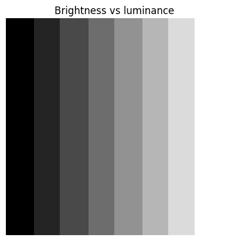

# Human Visual System

\center { height=80% }

\center (image take on: futura-sciences.com)

# Rods and Cones

- 100 millions of rods
- 6.5 millions of cones

# Camera VS human eye

A huge difference is the lens:

- lens varies for human eye $\Rightarrow$ change the focal of the lens
- lens doesn't vary for camera $\Rightarrow$ change the position of the plane

Another difference is the brightess adaptation:

- Human eyes have a huge dynamic range $O(10^{10})$
- contrast sensitivity is different...

$\Rightarrow$ the perceived brightness is very complex for the human eye !

# Example of brightness complexity

\center {width=70%}
