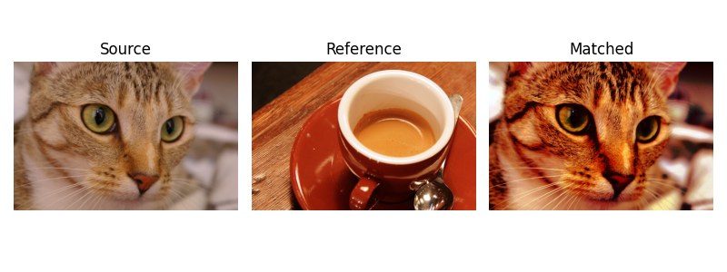
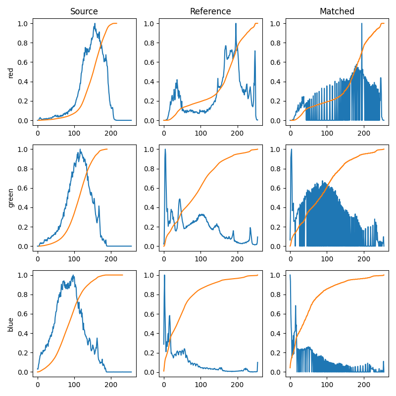

# Histogram matching: exemple

\center 

(exemple de scikit-image.org)

# Histogram matching: exemple

\center { width=70% }

# Histogram matching

$p(s)$ $\rightarrow$ histogram equalisation $\rightarrow$ uniform $\rightarrow$ inverse histogram equalisation $\rightarrow$ target histogram
