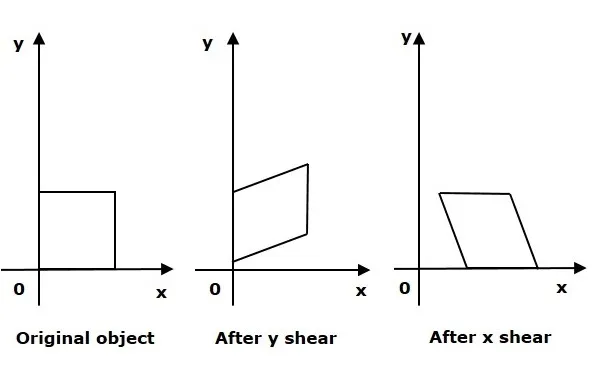
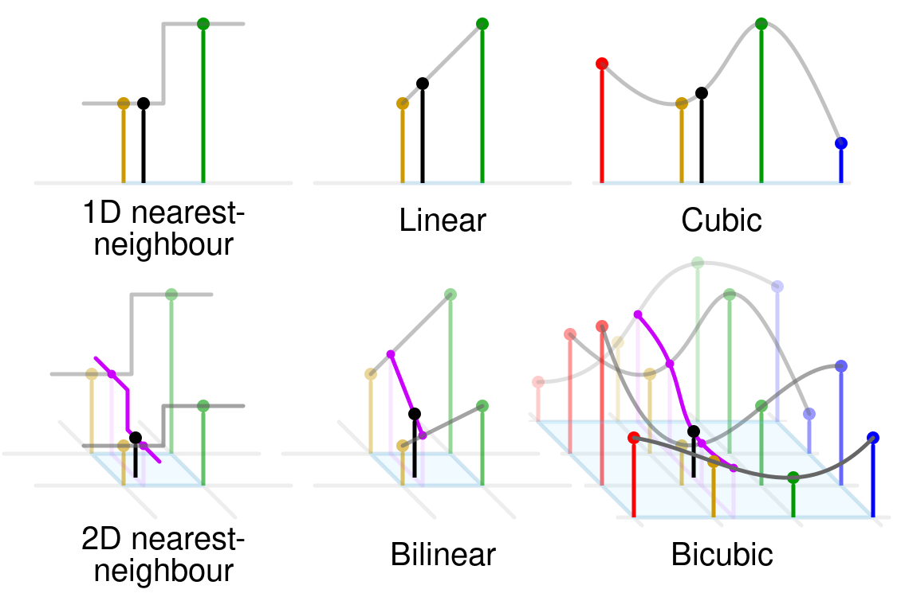

# Principe of rotation

\center { width=60% }
\center (source: wikipedia)

# Rotation matrix

$$\begin{bmatrix}
cos(\theta) & -sin(\theta) \\
sin(\theta) & cos(\theta)
\end{bmatrix}
$$

# Shearing

# Shearing: matrix

x shearing:
$$
\begin{matrix}
x = & w + bz \\
y = & z
\end{matrix}
$$

$$
\text{Matrix for shearing} = 
\begin{bmatrix}
1 & b \\
c & 1
\end{bmatrix}
$$

# Note

Interpolation is necessary because we are in a discrete space.

{ width=80% }
