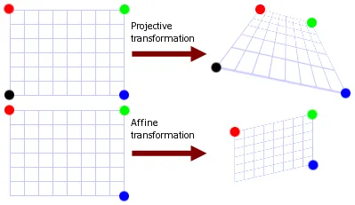
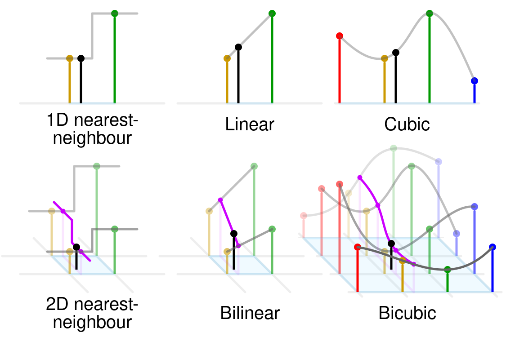

# Projective transformation vs affine transformation

# Rappel: affine matrix transformation

$$A = \begin{bmatrix}
a_{11} & a_{12} & b_1 \\
a_{21} & a_{22} & b_2 \\
0 & 0 & 1
\end{bmatrix}
$$

# Projective transformation

$$
\begin{bmatrix}
x \\ y
\end{bmatrix}
= \begin{bmatrix} \frac{a_{11}w + a_{12}z + b_1}{c_{1}w + c_{2}z + 1} \\ \frac{a_{21}w + a_{22}z + b_2}{c_{1}w + c_{2}z + 1}\end{bmatrix}$$

A projective transformation matrix is on the form

$$
\begin{bmatrix}
x' \\ y' \\ p
\end{bmatrix}
= \begin{bmatrix}
a_{11} & a_{12} & b_1 \\
a_{21} & a_{22} & b_2 \\ 
c_1 & c_2 & 1
\end{bmatrix} \times \begin{bmatrix} w \\ z \\ 1 \end{bmatrix}
$$

with
$$
\begin{bmatrix} x \\ y \end{bmatrix}
= \begin{bmatrix} \frac{x'}{p} \\ \frac{y'}{p} \end{bmatrix}
$$

# Note

To have pretty results (or not too bad results...), we must make an interpolation

{ width=80% }
