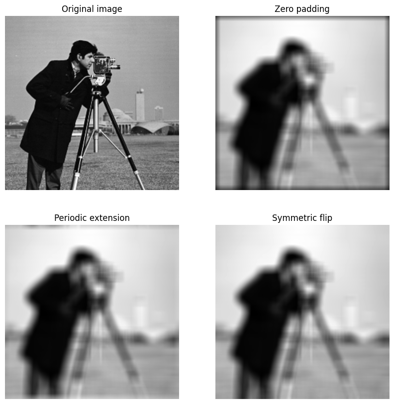
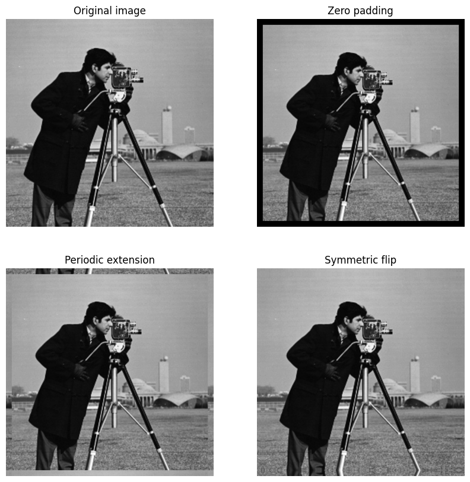

# Border effect example with box filter of 31x31

\center {width=70%}

# Border effect example with box filter of 31x31: padding

\center {width=70%}

# Size of filtered image with padding

Image of size (M, N) and filter of size (m, n)

Size of the image with padding: (M + m - 1, N + n - 1)
