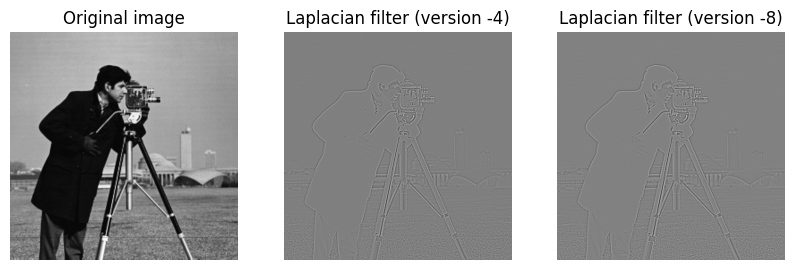
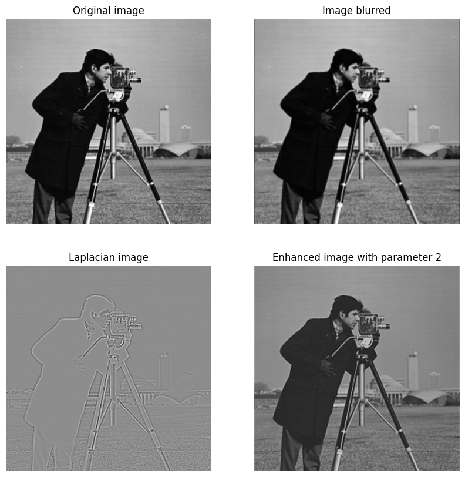

# Laplacian filter: structure

$$\nabla^2 f(x,y) = f(x - 1,y) + f(x + 1,y) + f(x,y - 1) + f(x,y + 1) - 4f(x,y)$$

It gives the filter below:

$$
\begin{bmatrix}
0 & 1 & 0 \\
1 & -4 & 1 \\
0 & 1 & 0
\end{bmatrix}
$$

It's possible to see this filter, which is also a laplacian filter

$$
\begin{bmatrix}
1 & 1 & 1 \\
1 & -8 & 1 \\
1 & 1 & 1
\end{bmatrix}
$$

# Laplacian filter: example

# Using laplacian filter to enhance image

\center {width=70%}
