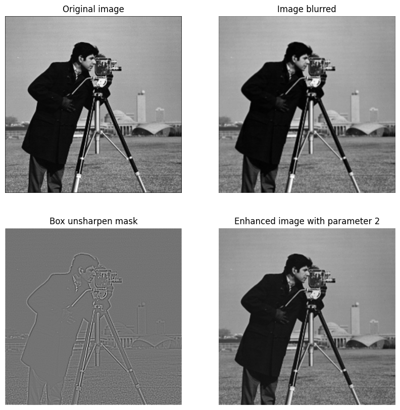
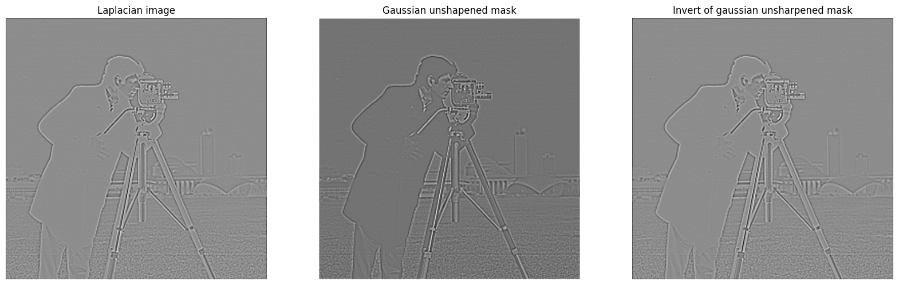

# Unsharpened mask with box filter

\center {width=70%}

# Unsharpened mask with gaussian filter

\center {width=70%}

# Unsharpened mask comparison

\center 

# Properties

$$g(x,y) = f(x,y) + \alpha [ f(x,y)- f(x,y) * h(x,y)]$$
$$= f(x,y) + \alpha f(x,y) * [ \delta(x,y) - h(x,y)]$$
