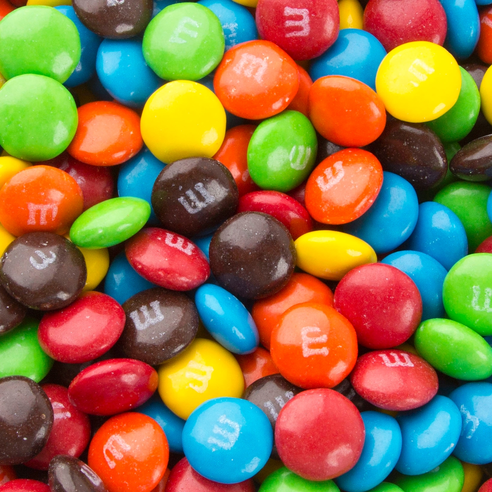
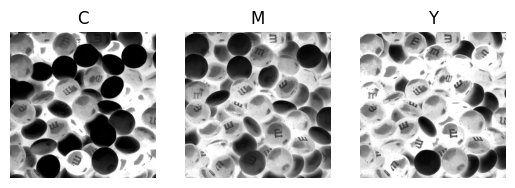
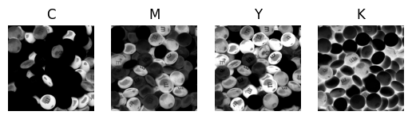
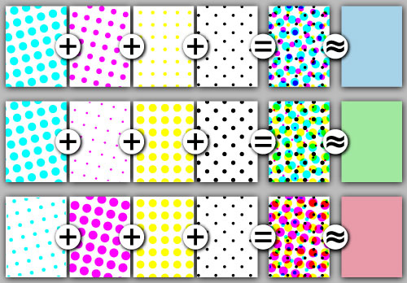

# Modèles de couleur


# CMY vs CMYK: qu'est ce que le K ?

```text
K: min(C; M; Y)
C = C - K
M = M - K
Y = Y - K
```

# CMY vs CMYK visuellement

\center {width=70%}

# CMY vs CMYK visuellement



# CMY vs CMYK visuellement



# Halftoning

- Une seule encre est utilisée
- L'écartement entre les points varie
- La taille des points varie

# Halftoning: exemple



# Utilisation de K: raisons

- économiques (+ chère de faire un mélange)
- pratique (imprime beaucoup de noir & papier avec mélange est plus mouillé...)
- visuelle (noir obtenu par mélange n'est pas parfait)
