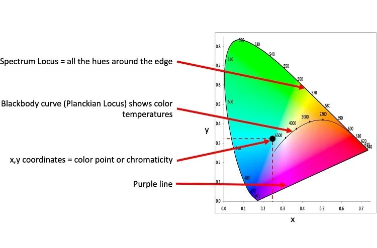
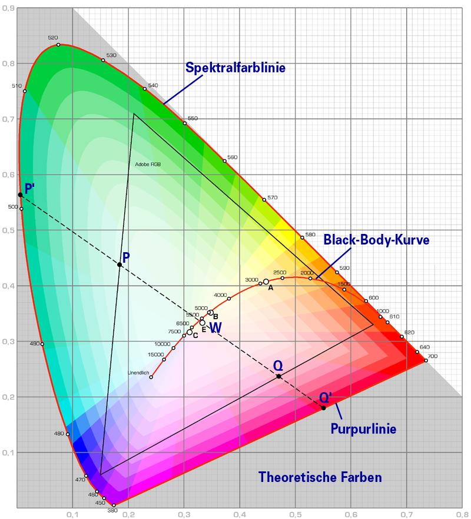

# Chromatic color diagram

# More details

{ width=65% }

# Factor which determine the achievable color gamut for the screens and printers

- Primary color choosen
- Number of bits to encode information
