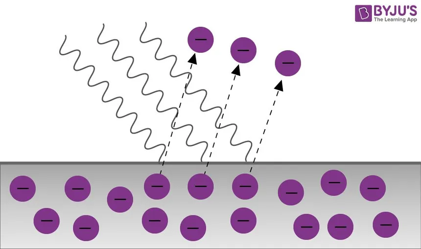
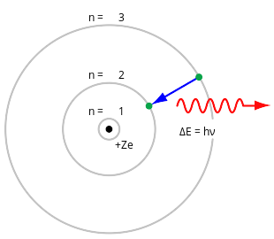
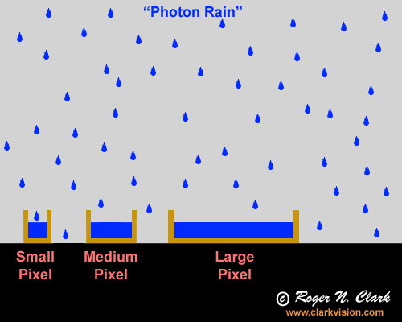

# Photon counting

# What I understand

\center { width=50% }
\center (source: wikipedia)

$$E_{photon} = hf = h \frac{c}{\lambda}\ \ (h \ \text{is the Planck constant})$$

# Analogy

\center { width=80% }

# Sensor: shema

