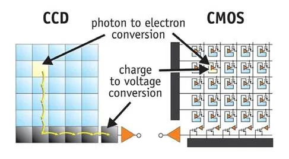

# Sensor: shema

# Pixel: shema

{ width=70% }

# Photodiode

Semi-conductor sensitive to photon radiation

Create an electric field when it absorb photons

# Sensor: CCD vs CMOS structure

{ width=80% }
