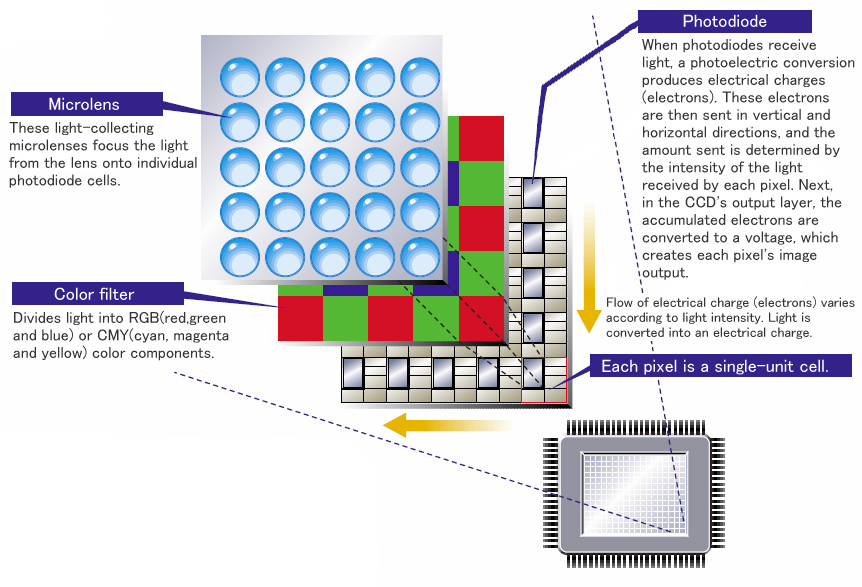

# Shéma

# Types de bruit

- agitation des électrons dans les senseurs
    * augmente en fonction de la température et de l'exposition
- Imperfection des pixels (Pattern Noise)

# Kind of pattern Noise

- Fixed pattern noise (FPN): différence entre pixels (pas à la lumière / additif)

- Photo-response non-uniformity (PRNU): dépend de l'exposition (multiplicatif)

# Fixed Pattern Noise

- Défaut de création des cristaux ou lentilles
- Impureté des cristaux
- Taille du détecteur
- Contamination durant la fabrication
- Non uniformité de la grille et de l'oxyde
- CMOS: variation pour chaque transistor de chaque pixel

Advantages: Ne varie pas avec le temps $\Rightarrow$ peut être estimé et corrigé !

# Photo-response non-uniformity

- La profondeur des détecteurs (quantité de photodiode)
- Zones actives plus grandes - plus de photons incident
- plus de photons absorbés suivant la longueur d'onde

Advantages: PRNU peut être estimé et supprimé de chaque image

PRNU donne l'empreinte de l'appareil
 
# Denoizing methods

- Enlever le bruit grâce à l'empreinte de l'appareil
- Prendre des photos avec une meilleure luminosité
- Prendre un meilleur quantizeur
- Traitement d'image
    - filtres (median, gaussian, box)
    - Moyenne de plusieurs images
    - Modifier la taille (diminuer, puis augmenter...)
    - BM3D
    - \dots
