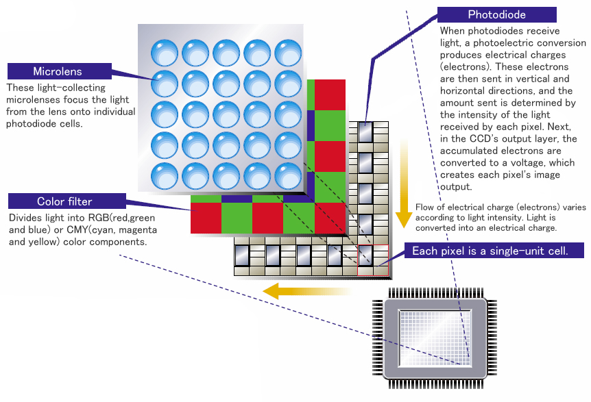
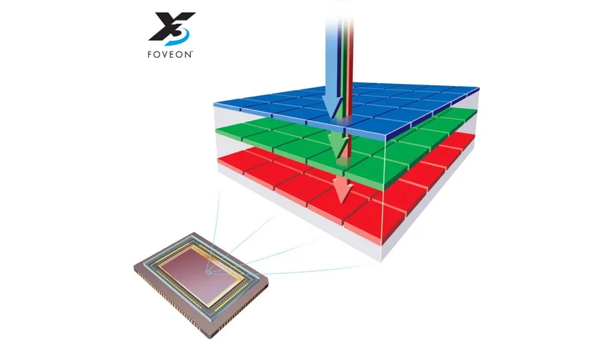
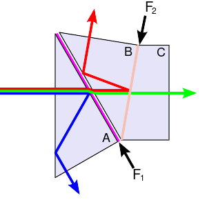
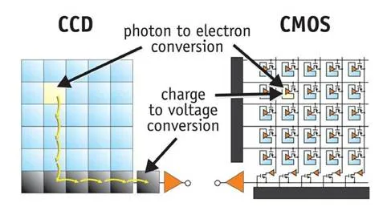
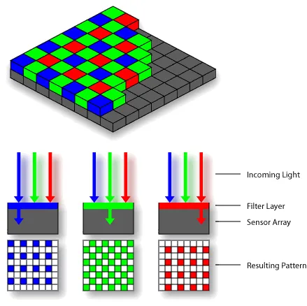
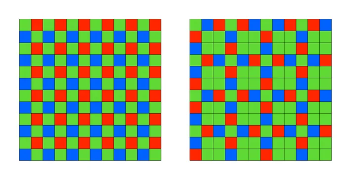
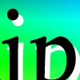
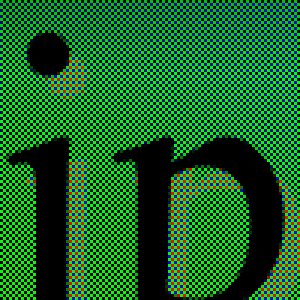
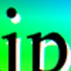

# CCD structure

# New: Fovean X3 structure

# 3-CCD architecture

{ width=60% }

- pros: no light loss
- cons: expansive and difficult to produce

# CCD vs CMOS

# Bayer filter

{ width=60% }

# Other filter

# Demosaicing: initial image

# Demosaicing: image obtained by the bayer filter

{ width=50% }

# Demosaicing: result

{ width=50% }

# Demosaicing: methods

- Linear interpolation (naïve way)
- Machine-learning algorithms
