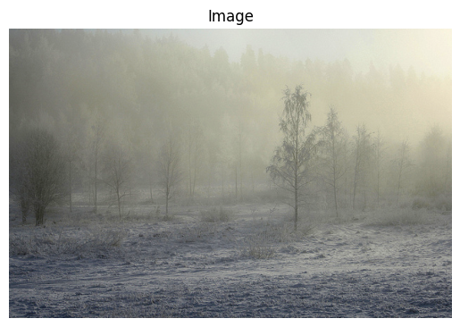

# Contrast stretching: formula

$$T[r] = \frac{255\ \text{(new dynamic range)}}{H - L \ \text{(old dynamic range)}}(r - L)$$

# Contrast stretching: example

| Before contrast stretching | After contrast stretching |
|:--------------------------:|:-------------------------:|
|{ width=50% }|{ width=50% }|

# Contrast stretching: histograms

|  |
|:-:|
|Before contrast stretching|
|{ width=50% }|
|After contrast stretching|
|{ width=50% }|

# Gamma correction: formula

$$T[r] = cr^{\gamma}$$

# Gamma correction: example

